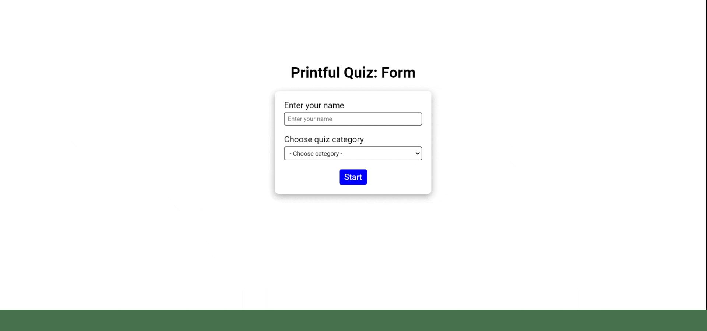

# Printful technical task



## Project architecture

1. App.vue. All of the application logic, as well as receiving data from the server via Axios, can be found here, from where the necessary data is passed to the children components. The application has mobile adaptive layout.
2. MainHeading component. A header that indicates which stage of aplication you are at.
3. Form.vue component. This is where the quiz starts. You need to fill Your name in certain field and select the quiz category as well. If this is not done, an error message will appear below the field after press Start button. When the fields are filled in, the message will disappear and you can proceed to the questions by pressing the button.
4. Questions component. Before the data is downloaded you see the Loading.vue component. Then you see a view with information: on which question you are on, a ProgressBar.vue component that visualizes your progress, question and answer options. You will not be able to go to the next question until you have chosen one of the options.
5. Results component. Here you will see your typed name and your result. From here you can go through quiz over again.
6. DataError component. In case of unforeseen errors with the server, it will be displayed instead of the quiz.

---

## Project setup

```
npm install
```

### Compiles and hot-reloads for development

```
npm run serve
```

### Compiles and minifies for production

```
npm run build
```

### Lints and fixes files

```
npm run lint
```

### Axios (Receiving data from the server)

```
npm install axios
```

### Customize configuration

See [Configuration Reference](https://cli.vuejs.org/config/).
